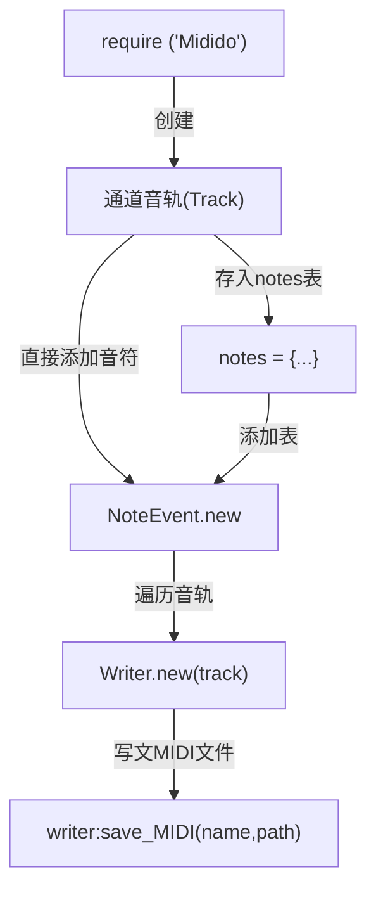

# Midido User wiki

> Midido ♫¶
> 一个用于读写MIDI文件，且具有十分友好的API的Lua扩库。它提供的MIDI数据是完全抽象的，因此并不需要用户担心那些诸如增量时间(Delta Time)和音符信号(NoteOn/NoteOff)这样的技术问题。它的方法是直观且具体的，同时对象数据也具有良好的可读性。 值得一提的是——这个扩展库不需要 任何 依赖。

这里是Midido的API介绍wiki，你可以在这里知晓Midido绝大部分API的用途、原理，以便在编写乐谱脚本时能更快更准确的达到自己想要的效果。废话就不多说了，让我们快点开始吧~

## 开始，安装和调用

在使用前，你需要将脚本全部解压至 `DiceQQ\plugin\` 目录下，或者 `Diceki\lua\` 也可以，但这边特别推荐放在 `DiceQQ\plugin\` 目录下，因为这涉及到生成文件的路径问题，同时本教程的示例代码也是根据 `DiceQQ\plugin\` 目录来编写的。

调用：

```lua
local Midido = require ('Midido')
```

## 编写一个简单的脚本

那么现在来编写一个简单的生成midi的脚本吧~
新建 `test.lua`文件，将下面的代码复制粘贴进去，保存，随后使用 `.system load`命令重载。
在重载时 `test.lua`会被执行，生成 `test.mid`文件。

```lua title="test.lua"
local Midido = require ('Midido')
local Track = Midido.Track
local NoteEvent = Midido.NoteEvent
local Writer = Midido.Writer

-- 创建通道音轨(Track)实例
local track = Track.new()

-- 将音符存为notes表中的键值(必须是指定的八度音阶音符)
local notes = {'C3', 'D3', 'E3', 'F3', 'G3', 'A3', 'B3', 'C4'}

-- 将音符添加到音轨
track:add_events(NoteEvent.new({pitch = notes, sequential = true}))

-- 遍历音轨
local writer = Writer.new(track)

-- 在`Midido\project\`内生成一个名为《C Major Scale》的MIDI文件
writer:save_MIDI('test',getDiceQQ().."\\plugin\\Midido\\project")
```

> 由于代码中已经有一些注释，因此不需要对其再进行解释说明。 这是 MIDI 文件构建的基本步骤。 有一个更复杂的例子可以在 Writing Stairway to Heaven 中看到。 有关它的进一步说明，请查看 类 页面。

## 剖析、分解示例脚本

通过运行上述脚本，我们已经知晓了MIDI 文件构建的最基本步骤：


> to be...